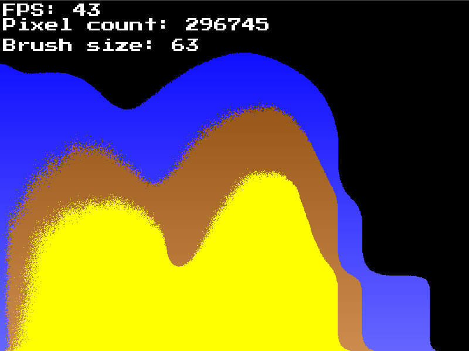

# PixelGarden
A simple Sand Simulation made as a challenge for myself, Turned out to be one of my coolest projects that i've done in a while!  
[download here!](https://github.com/SpazElectro/PixelGarden/raw/master/.github/preview.7z)
  

## Controls
|     Button     |      Action      |
|----------------|------------------|
| Mouse Button 1 |  Place down sand |
| 1              |  Switch to air   |
| 2              |  Switch to sand  |
| 3              |  Switch to mud   |
| 4              |  Switch to water |
| F5             |  Reload shader   |
